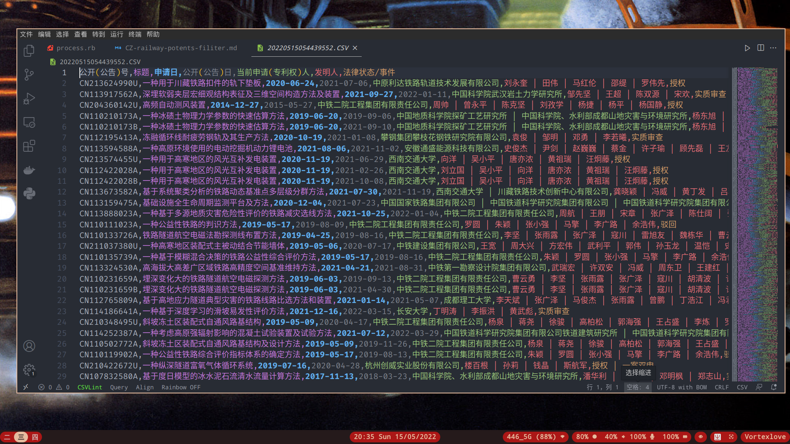
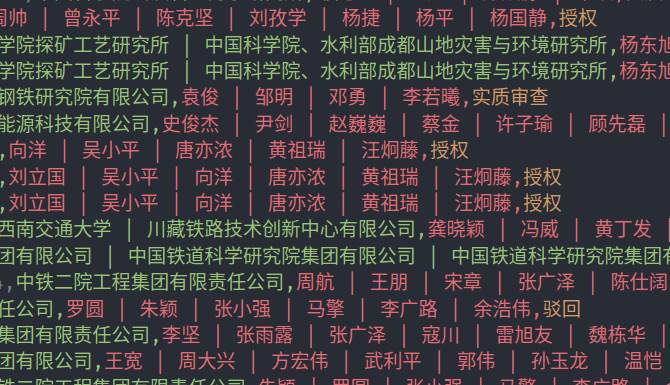

# 川藏铁路专利及联合专利的筛查处理

在研究中，我们需要对川藏铁路的专利进行检索。首先在 [智慧芽](https://analytics.zhihuiya.com/) 对川藏铁路的专利进行检索。


检索共发现了 **531** 条专利。要筛查这些专利，最好的方法是下载到本地对数据用代码进行批量处理，从而得到满意的准确率和效率。

在导出选项中，除了标题、申请日外，我们还需要导出 *当前申请（专利权）人* 和*法律状态/事件* 两个字段。专利权字段是为了帮助我们确定专利的主体，法律状态是为了让我们筛除掉一些被驳回的无效专利。

导出的数据概览如下：



在这里导出的数据是 `csv` 而不是 `xlsx` 格式。这是因为分隔符表作为纯文本形式的文件类型，相较于富文本格式更加方便处理。

在这里，处理数据的编程语言是 `Ruby` . 因为 `Ruby` 的 `csv` 库可以方便地批量处理表中的数据。

首先导入 `csv` 标准库，并进行一些简单的初始化：

```ruby
require ‘csv’

data = CSV.read('data.csv', headers:true)

CSV.open("result.csv", "wb") do |csv|
    csv << ["row", "of", "CSV", "data"]
    csv << ["another", "row"]
    # ...
end

```

在这里，首先使用了 `csv` 标准库的 `read\(\)` 方法，打开我们在智慧芽导出的 `data.csv` 文件。然后又使用了 `open\(\)` 语法，来新建并处理一个新的 `csv` 文件。接下来关注的是程序逻辑。



通过观察我们看到，有多个专利主体的条目，其中都有竖直线符号 `|` 分割每个专利权所有人。所以我们对包含有竖直线的行写入新建文件：

```ruby
data = CSV.read('data.csv', headers:true)

CSV.open("result.csv", "wb") do |csv|
    for row in data do
        if row[4].include? '|' and row[6] != "驳回" and row[6] != "撤回" then
            csv << row
        end
    end
end

```

`csv` 的 `include` 方法用于检查第五列中字段是否包含竖直线符号。除此之外，程序还筛除了 *驳回* 和 *撤回* 两种法律状态的专利。

有关文件可在下面链接中下载：

- 原始数据：[data.csv](File://data.csv)

