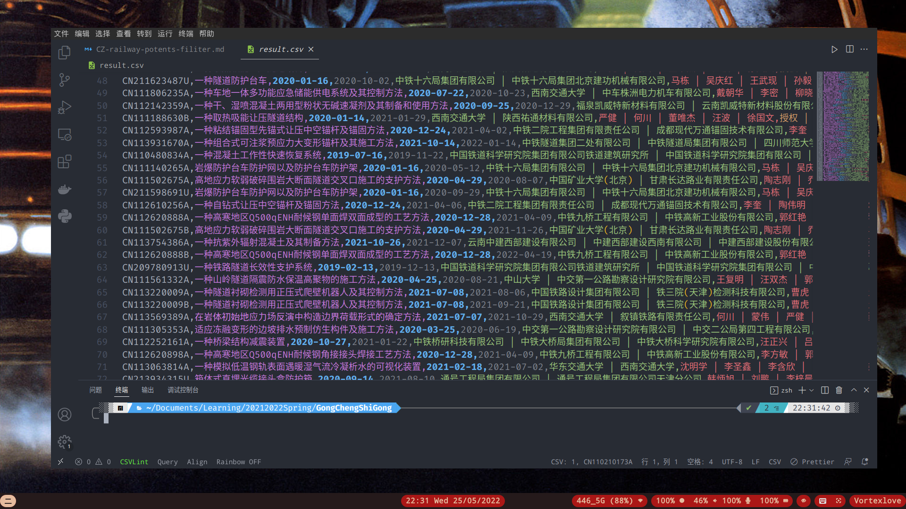
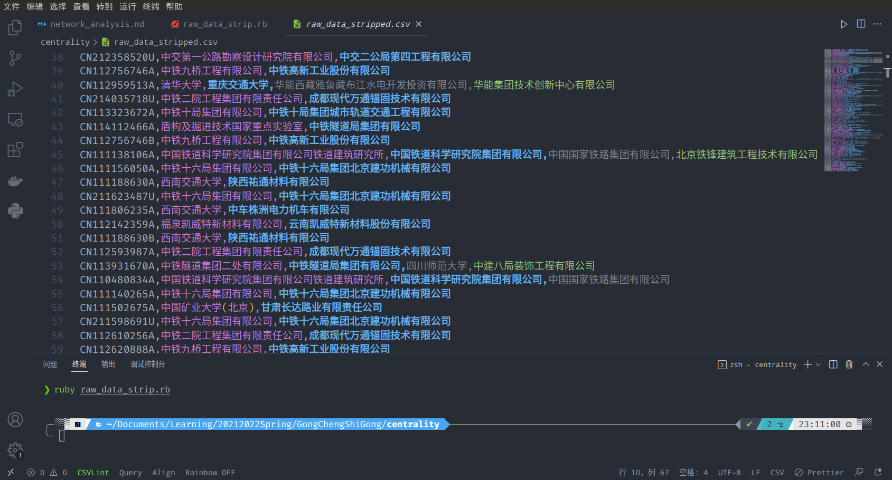

# 使用 Igraph 与 R 进行社会网络分析

在 [**上一节**](CZ-railway-potents-filiter) 的工作中筛出了有多个专利人的联合专利。但是要做接下来的的数据分析，还要再将数据进一步处理。

我们使用的工具是 **社会网络分析**（Social Network Analysis, SNP）。在技术选型中，有 `NetworkX`, `Igraph` 两个著名的图论及网络分析库。除此之外，笔者也同样查到关于 `Julia` 语言的 `Graphs.ji` 及 `lightgraph.ji` 图论计算库。由于 `Graphs.ji` 库的开发不够成熟，及 `NetworkX` 库的操作复杂，本项目选择基于 `R` 语言的 `Igraph` 库进行数据分析工作。

进入 R 的交互会话：

```bash
$ R
```

安装 `Igraph` 库：

```r
install.packages(c("igraph"))
```

!> 由于 `Igraph` 库的安装方式是拉取源码在本地编译，若安装失败可检查如 `gcc` 或 `gcc-fortran` 等编译工具在本地是否存在。

要使用网络图来分析各个企业或机构（即数据中的专利人）的合作情况，故在目标网络图中每一个专利人被视作一个节点，各个节点通过在专利中的合作关系而被连接。

首先观察之前导出的数据：



我们要找出各个企业的合作关系，仅需要第一列的专利编号及第五列的专利权人情况。依然使用 `Ruby` 的 `csv` 库来剔除其他数据：

```ruby
# frozen_string_literal: true

require 'csv'

# Read raw data file.
raw_data_file = CSV.read('raw_data.csv', headers: false, encoding: 'BOM|UTF-8')

# Creat a csv file named "raw_data_stripped.csv" to save the stripped data.
CSV.open('raw_data_stripped.csv', 'wb') do |csv|
  # Iter the raw data file by lines.
  raw_data_file.each do |row|
    # Generate a empty array.
    result_row = []
    # Let the potent code be the first column.
    result_row << row[0]
    # Split the potent owner string by pattern " | " into an array, and append it to result row.
    result_row += row[4].split(' | ')
    csv << result_row
  end
end

```

程序代码的编写逻辑已在注释中写明。脱除无关数据后的结果如下：



网络中的每一个节点之间都有连接。

| Node | Connecting |
| :--: | :--------: |
|  a   |    b,c     |
|  b   |    a,d     |
|  c   |    a,d     |
|  d   |    b,c     |

如表格所示的是一个简单的拓扑关系。在这个图中，有 `a, b, c, d` 四个节点，而它们两两之间或者连接或者不被连接。我们也可以把它们写作一个矩阵形式的表格，来更直观地表示它们的连接关系。

|     |  a  |  b  |  c  |  d  |
| :-: | :-: | :-: | :-: | :-: |
|  a  | Nil |  1  |  1  |  0  |
|  b  |  1  | Nil |  0  |  1  |
|  c  |  1  |  0  | Nil |  1  |
|  d  |  0  |  1  |  1  | Nil |

网络中的 $n$ 个节点顺序排列，每一个节点都可做连接关系的两端。我们做的网络图是无指向性的，不过仍可以区分每一连接关系两端的不同节点。$n$ 个节点中的第 $i$ 个节点与第 $j$ 个节点的连接关系，用 $a_{ij}$ 来表示：若 $a_{ij} = 0$, 则表明两个节点未连接；若 $a_{ij} = 1$, 则表明两个节点存在连接。$a_{ij}$ 按行列排列，形成一个 $n$ 维矩阵 $R_{ij}$:

$$

R_{ij} =

\begin{bmatrix}
a_{11} & a_{12} & ... & a_{1n} \\
a_{21} & a_{22} & ... & a_{2n} \\
  ...  &  ...   & ... &  ...   \\
a_{n1} & a_{n2} & ... & a_{nn}
\end{bmatrix}
$$

这就是网络的 **邻接矩阵**（Adjacency Matrix）。

对于我们的每个专利人，如果使用中文全名的话，会带来数据处理的不便。比如参差不齐或过于冗长的节点 ID, 或者是 CJK 字符带来的未知程序错误。所以我们为每个专利人单独命名，存放在 `entity.csv` 中。

```ruby
# frozen_string_literal: true

require 'csv'

# Read data from file.
stripped_raw = CSV.read('raw_data_stripped.csv', headers: false, encoding: 'BOM|UTF-8')

company_list = []
institute_list = []
indie_list = []

stripped_raw.each do |row|
  row.each do |item|
    if item.include?('公司') || item.include?('联盟')
      checker = true
      company_list.each do |cmp|
        checker = false if cmp == item
      end
      company_list << item if checker
    elsif item.include?('大学') || item.include?('院') || item.include?('所') ||
          item.include?('实验室') || item.include?('建设中心')
      checker = true
      institute_list.each do |ist|
        checker = false if ist == item
      end
      institute_list << item if checker
    elsif item.include?('CN') == false
      checker = true
      indie_list.each do |ind|
        checker = false if ind == item
      end
      indie_list << item if checker
    end
  end
end

company_list.sort!
institute_list.sort!
indie_list.sort!

puts company_list
puts institute_list
puts indie_list

```

我们发现在专利人大致可以分为三种：即公司、机构和个人。所以我们计划为他们赋予各个不同格式的 ID(C__ for company; I__ for institute; S__ for indie self) 来使网络图更加直观。

接着将其写入目标文件：

```ruby
CSV.open('entity_id.csv', 'wb') do |csv|
  code = 0
  company_list.each do |entity|
    csv << [entity, "C#{code}"]
    code += 1
  end
  code = 0
  institute_list.each do |entity|
    csv << [entity, "I#{code}"]
    code += 1
  end
  code = 0
  indie_list.each do |entity|
    csv << [entity, "S#{code}"]
    code += 1
  end
end

```

接着处理剔除无关数据的专利表：

```ruby
entity_id = CSV.read('entity_id.csv', headers: false, encoding: 'BOM|UTF-8')

CSV.open('raw_data_with_id.csv', 'wb') do |csv|
  stripped_raw.each do |row|
    result_row = []
    result_row << row[0]
    row.each do |item|
      entity_id.each do |id|
        result_row << id[1] if item == id[0]
      end
    end
    csv << result_row
  end
end

```

现在我们可以编写二维数组来表示邻接矩阵了。我们的方法是建立一个数组，代表每一行；数组中每个元素都是同样长度的数组，代表每一列。在内层数组中，每一个元素都代表一个整形，表示两个专利人的连接次数。

?> 我们这里没有单纯使用 `[0, 1]` 来表示连接关系，这是因为两个专利人可能会在不同专利中多次合作。通过整数值来记录连接次数，不仅可以记录两个专利人之间的合作关系，同时也可以保留专利人合作次数的信息，方便后续计算节点间的距离，或者连接的权重。

```ruby
# frozen_string_literal: true

require 'csv'

# Read data from file.
entity_id_file = CSV.read('entity_id.csv', headers: false, encoding: 'BOM|UTF-8')

id = []

entity_id_file.each do |row|
  id << row[1]
end

puts id

matrix = Array.new(id.size) { Array.new(id.size, 0) }

puts matrix

raw_data_with_id = CSV.read('raw_data_with_id.csv', headers: false, encoding: 'BOM|UTF-8')

raw_data_with_id.each do |row|
  id.each do |entity|
    next unless row.include?(entity)

    row.each do |item|
      puts id.index(entity)
      puts id.index(item)
      matrix[id.index(entity)][id.index(item)] += 1 if item != entity && item.include?('CN') == false
    end
  end
end

puts matrix[1] == matrix[12]

CSV.open('matrix.csv', 'wb') do |csv|
  matrix.each do |row|
    csv << row
  end
end

```

导出的矩阵数组在这里下载：

- 邻接矩阵： [matrix.csv](https://yechanv.vercel.app/centrality/matrix.csv)
