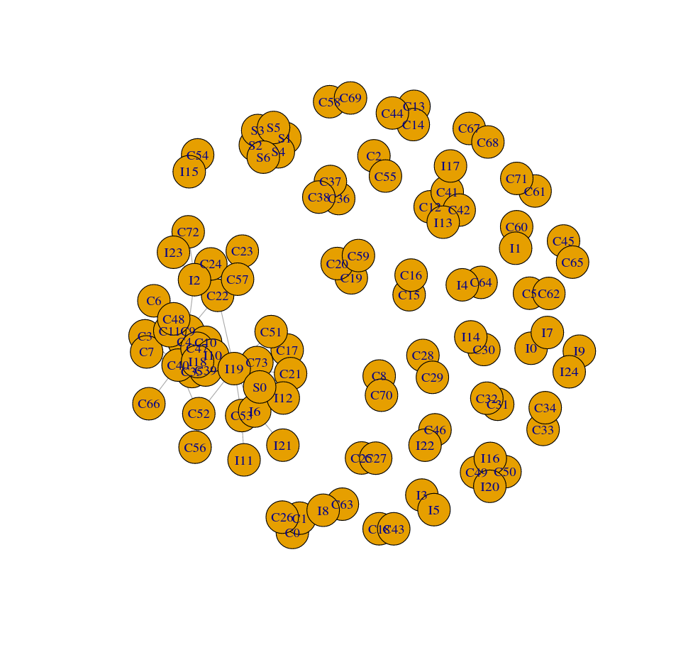

# 使用 Igraph 与 R 进行社会网络分析

在 [**上一节**](CZ-railway-potents-filiter) 的工作中筛出了有多个专利人的联合专利。但是要做接下来的的数据分析，还要再将数据进一步处理。

我们使用的工具是 **社会网络分析**（Social Network Analysis, SNP）。在技术选型中，有 `NetworkX`, `Igraph` 两个著名的图论及网络分析库。除此之外，笔者也同样查到关于 `Julia` 语言的 `Graphs.ji` 及 `lightgraph.ji` 图论计算库。由于 `Graphs.ji` 库的开发不够成熟，及 `NetworkX` 库的操作复杂，本项目选择基于 `R` 语言的 `Igraph` 库进行数据分析工作。

进入 R 的交互会话：

```bash
$ R
```

安装 `Igraph` 库：

```r
install.packages(c("igraph"))
```

!> 由于 `Igraph` 库的安装方式是拉取源码在本地编译，若安装失败可检查如 `gcc` 或 `gcc-fortran` 等编译工具在本地是否存在。

要使用网络图来分析各个企业或机构（即数据中的专利人）的合作情况，故在目标网络图中每一个专利人被视作一个节点，各个节点通过在专利中的合作关系而被连接。

首先观察之前导出的数据：


我们要找出各个企业的合作关系，仅需要第一列的专利编号及第五列的专利权人情况。依然使用 `Ruby` 的 `csv` 库来剔除其他数据：

```ruby
# frozen_string_literal: true

require 'csv'

# Read raw data file.
raw_data_file = CSV.read('raw_data.csv', headers: false, encoding: 'BOM|UTF-8')

# Creat a csv file named "raw_data_stripped.csv" to save the stripped data.
CSV.open('raw_data_stripped.csv', 'wb') do |csv|
  # Iter the raw data file by lines.
  raw_data_file.each do |row|
    # Generate a empty array.
    result_row = []
    # Let the potent code be the first column.
    result_row << row[0]
    # Split the potent owner string by pattern " | " into an array, and append it to result row.
    result_row += row[4].split(' | ')
    csv << result_row
  end
end

```

程序代码的编写逻辑已在注释中写明。脱除无关数据后的结果如下：


网络中的每一个节点之间都有连接。

| Node | Connecting |
| :--: | :--------: |
|  a   |    b,c     |
|  b   |    a,d     |
|  c   |    a,d     |
|  d   |    b,c     |

如表格所示的是一个简单的拓扑关系。在这个图中，有 `a, b, c, d` 四个节点，而它们两两之间或者连接或者不被连接。我们也可以把它们写作一个矩阵形式的表格，来更直观地表示它们的连接关系。

|     |  a  |  b  |  c  |  d  |
| :-: | :-: | :-: | :-: | :-: |
|  a  | Nil |  1  |  1  |  0  |
|  b  |  1  | Nil |  0  |  1  |
|  c  |  1  |  0  | Nil |  1  |
|  d  |  0  |  1  |  1  | Nil |

网络中的 $n$ 个节点顺序排列，每一个节点都可做连接关系的两端。我们做的网络图是无指向性的，不过仍可以区分每一连接关系两端的不同节点。$n$ 个节点中的第 $i$ 个节点与第 $j$ 个节点的连接关系，用 $a_{ij}$ 来表示：若 $a_{ij} = 0$, 则表明两个节点未连接；若 $a_{ij} = 1$, 则表明两个节点存在连接。$a_{ij}$ 按行列排列，形成一个 $n$ 维矩阵 $R_{ij}$:

$$

R_{ij} =

\begin{bmatrix}
a_{11} & a_{12} & ... & a_{1n} \\
a_{21} & a_{22} & ... & a_{2n} \\
  ...  &  ...   & ... &  ...   \\
a_{n1} & a_{n2} & ... & a_{nn}
\end{bmatrix}
$$

这就是网络的 **邻接矩阵**（Adjacency Matrix）。

对于我们的每个专利人，如果使用中文全名的话，会带来数据处理的不便。比如参差不齐或过于冗长的节点 ID，或者是 CJK 字符带来的未知程序错误。所以我们为每个专利人单独命名，存放在 `entity.csv` 中。

```ruby
# frozen_string_literal: true

require 'csv'

# Read data from file.
stripped_raw = CSV.read('raw_data_stripped.csv', headers: false, encoding: 'BOM|UTF-8')

company_list = []
institute_list = []
indie_list = []

stripped_raw.each do |row|
  row.each do |item|
    if item.include?('公司') || item.include?('联盟')
      checker = true
      company_list.each do |cmp|
        checker = false if cmp == item
      end
      company_list << item if checker
    elsif item.include?('大学') || item.include?('院') || item.include?('所') ||
          item.include?('实验室') || item.include?('建设中心')
      checker = true
      institute_list.each do |ist|
        checker = false if ist == item
      end
      institute_list << item if checker
    elsif item.include?('CN') == false
      checker = true
      indie_list.each do |ind|
        checker = false if ind == item
      end
      indie_list << item if checker
    end
  end
end

company_list.sort!
institute_list.sort!
indie_list.sort!

puts company_list
puts institute_list
puts indie_list

```

我们发现在专利人大致可以分为三种：即公司、机构和个人。所以我们计划为他们赋予各个不同格式的 ID(C__ for company; I__ for institute; S__ for indie self) 来使网络图更加直观。

接着将其写入目标文件：

```ruby
CSV.open('entity_id.csv', 'wb') do |csv|
  code = 0
  company_list.each do |entity|
    csv << [entity, "C#{code}"]
    code += 1
  end
  code = 0
  institute_list.each do |entity|
    csv << [entity, "I#{code}"]
    code += 1
  end
  code = 0
  indie_list.each do |entity|
    csv << [entity, "S#{code}"]
    code += 1
  end
end

```

接着处理剔除无关数据的专利表：

```ruby
entity_id = CSV.read('entity_id.csv', headers: false, encoding: 'BOM|UTF-8')

CSV.open('raw_data_with_id.csv', 'wb') do |csv|
  stripped_raw.each do |row|
    result_row = []
    result_row << row[0]
    row.each do |item|
      entity_id.each do |id|
        result_row << id[1] if item == id[0]
      end
    end
    csv << result_row
  end
end

```

现在我们可以编写二维数组来表示邻接矩阵了。我们的方法是建立一个数组，代表每一行；数组中每个元素都是同样长度的数组，代表每一列。在内层数组中，每一个元素都代表一个整形，表示两个专利人的连接次数。

?> 我们这里没有单纯使用 `[0, 1]` 来表示连接关系，这是因为两个专利人可能会在不同专利中多次合作。通过整数值来记录连接次数，不仅可以记录两个专利人之间的合作关系，同时也可以保留专利人合作次数的信息，方便后续计算节点间的距离，或者连接的权重。

```ruby
# frozen_string_literal: true

require 'csv'

# Read data from file.
entity_id_file = CSV.read('entity_id.csv', headers: false, encoding: 'BOM|UTF-8')

id = []

entity_id_file.each do |row|
  id << row[1]
end

puts id

matrix = Array.new(id.size) { Array.new(id.size, 0) }

puts matrix

raw_data_with_id = CSV.read('raw_data_with_id.csv', headers: false, encoding: 'BOM|UTF-8')

raw_data_with_id.each do |row|
  id.each do |entity|
    next unless row.include?(entity)

    row.each do |item|
      puts id.index(entity)
      puts id.index(item)
      matrix[id.index(entity)][id.index(item)] += 1 if item != entity && item.include?('CN') == false
    end
  end
end

puts matrix[1] == matrix[12]

CSV.open('matrix.csv', 'wb') do |csv|
  matrix.each do |row|
    csv << row
  end
end

```

导出的矩阵数组在这里下载：

- 邻接矩阵： [matrix.csv](https://yechanv.vercel.app/centrality/matrix.csv)

至此，我们终于可以开始绘网络图了。使用 `Igraph` 包，将我们的网络矩阵导入。

```r
library(igraph)

a_matrix_file <- read.csv("matrix.csv", header = FALSE, encoding = "UTF-8")

a_matrix <- as.matrix(a_matrix_file)

entity_id_file <- read.csv("entity_id.csv", header = FALSE, encoding = "UTF-8")

entity_id <- as.matrix(entity_id_file)

label <- entity_id[, 2]


g <- graph.adjacency(a_matrix, mode = "undirected", weighted = T)

plot(g, vertex.label = label)

savePlot("centrality/03", type = "png")

```
需要注意的是，我们应当将 `weighted` 这一参数设置为 `T` 以此来自动计算每一连接的权重。否则就会出现两个节点间出现多条连接边。

输出的图像如下：



这个图像的显示效果不是很好。不过没关系，我们会根据网络图的属性之后再改变各个节点的大小、色彩及节点间的距离。不过在此之前，我们希望能计算出一些需要的数据，如 **中心性**（Centrality）。

```r
# Degree centrality
print(degree(g, mode = "total"))

# Closeness centrality
print(closeness(g))

# Betweenness centrality
print(betweenness(g, directed = FALSE))

```

点度中心度：

```
  V1   V2   V3   V4   V5   V6   V7   V8   V9  V10  V11  V12  V13  V14  V15  V16 
   2    3    1    4   11    1    3    4    1   16    9    7    3    2    2    1 
 V17  V18  V19  V20  V21  V22  V23  V24  V25  V26  V27  V28  V29  V30  V31  V32 
   1    1    1    2    2    1    6    1    2    1    2    1    1    1    1    1 
 V33  V34  V35  V36  V37  V38  V39  V40  V41  V42  V43  V44  V45  V46  V47  V48 
   1    1    1    9    2    2    2    9   14    4    3    1    2    1    1    9 
 V49  V50  V51  V52  V53  V54  V55  V56  V57  V58  V59  V60  V61  V62  V63  V64 
   4    3    3    1    3    3    1    1    1    1    1    2    1    1    1    1 
 V65  V66  V67  V68  V69  V70  V71  V72  V73  V74  V75  V76  V77  V78  V79  V80 
   1    1    1    1    1    1    1    1    1    1    1    1    5    1    1    1 
 V81  V82  V83  V84  V85  V86  V87  V88  V89  V90  V91  V92  V93  V94  V95  V96 
   3    1    2    1    9    1    1    3    1    1    3    1    9   19    3    1 
 V97  V98  V99 V100 V101 V102 V103 V104 V105 V106 
   1    1    1    1    5    5    5    5    5    5

```

接近中心度：

```
         V1          V2          V3          V4          V5          V6 
0.050000000 0.071428571 1.000000000 0.009615385 0.010989011 0.500000000 
         V7          V8          V9         V10         V11         V12 
0.009090909 0.009615385 0.500000000 0.012048193 0.010869565 0.009433962 
        V13         V14         V15         V16         V17         V18 
0.200000000 0.333333333 0.333333333 0.500000000 0.500000000 0.009803922 
        V19         V20         V21         V22         V23         V24 
0.200000000 0.333333333 0.333333333 0.009803922 0.010416667 0.007751938 
        V25         V26         V27         V28         V29         V30 
0.006666667 0.200000000 0.050000000 0.200000000 1.000000000 1.000000000 
        V31         V32         V33         V34         V35         V36 
0.500000000 0.125000000 0.125000000 1.000000000 1.000000000 0.011764706 
        V37         V38         V39         V40         V41         V42 
0.250000000 0.250000000 0.250000000 0.011764706 0.012048193 0.250000000 
        V43         V44         V45         V46         V47         V48 
0.200000000 0.200000000 0.500000000 1.000000000 0.500000000 0.010869565 
        V49         V50         V51         V52         V53         V54 
0.006993007 0.333333333 0.333333333 0.009803922 0.010526316 0.007633588 
        V55         V56         V57         V58         V59         V60 
0.500000000 1.000000000 0.006211180 0.004385965 1.000000000 0.500000000 
        V61         V62         V63         V64         V65         V66 
1.000000000 1.000000000 0.500000000 0.045454545 0.500000000 1.000000000 
        V67         V68         V69         V70         V71         V72 
0.008620690 1.000000000 1.000000000 1.000000000 0.500000000 1.000000000 
        V73         V74         V75         V76         V77         V78 
0.005882353 0.004975124 1.000000000 1.000000000 0.007299270 0.500000000 
        V79         V80         V81         V82         V83         V84 
0.500000000 0.500000000 0.007633588 1.000000000 0.062500000 1.000000000 
        V85         V86         V87         V88         V89         V90 
0.011764706 0.006097561 0.009803922 0.200000000 0.500000000 0.500000000 
        V91         V92         V93         V94         V95         V96 
0.333333333 0.142857143 0.011764706 0.014492754 0.333333333 0.006097561 
        V97         V98         V99        V100        V101        V102 
0.500000000 0.004926108 1.000000000 0.007407407 0.200000000 0.200000000 
       V103        V104        V105        V106 
0.200000000 0.200000000 0.200000000 0.200000000

```

中介中心度：

```
         V1          V2          V3          V4          V5          V6 
  0.0000000   4.0000000   0.0000000   2.3333333   0.1428571   0.0000000 
         V7          V8          V9         V10         V11         V12 
 34.1904762   2.3333333   0.0000000 152.8809524   0.0000000   8.9761905 
        V13         V14         V15         V16         V17         V18 
  0.0000000   0.0000000   0.0000000   0.0000000   0.0000000   0.0000000 
        V19         V20         V21         V22         V23         V24 
  0.0000000   0.0000000   0.0000000   0.0000000  91.5000000   0.0000000 
        V25         V26         V27         V28         V29         V30 
  2.2500000   0.0000000   0.0000000   0.0000000   0.0000000   0.0000000 
        V31         V32         V33         V34         V35         V36 
  0.0000000   0.0000000   0.0000000   0.0000000   0.0000000   4.5190476 
        V37         V38         V39         V40         V41         V42 
  0.0000000   0.0000000   0.0000000   4.5190476  94.6190476   3.0000000 
        V43         V44         V45         V46         V47         V48 
  0.0000000   0.0000000   0.5000000   0.0000000   0.0000000   0.0000000 
        V49         V50         V51         V52         V53         V54 
  0.0000000   0.0000000   0.0000000   0.0000000  33.0000000  33.0000000 
        V55         V56         V57         V58         V59         V60 
  0.0000000   0.0000000   0.0000000   0.0000000   0.0000000   0.5000000 
        V61         V62         V63         V64         V65         V66 
  0.0000000   0.0000000   0.0000000   0.0000000   0.0000000   0.0000000 
        V67         V68         V69         V70         V71         V72 
  0.0000000   0.0000000   0.0000000   0.0000000   0.0000000   0.0000000 
        V73         V74         V75         V76         V77         V78 
  0.0000000   0.0000000   0.0000000   0.0000000  66.5000000   0.0000000 
        V79         V80         V81         V82         V83         V84 
  0.0000000   0.0000000  33.0000000   0.0000000   3.0000000   0.0000000 
        V85         V86         V87         V88         V89         V90 
  4.5190476   0.0000000   0.0000000   0.0000000   0.0000000   0.0000000 
        V91         V92         V93         V94         V95         V96 
  0.0000000   0.0000000   4.5190476 365.2690476   0.0000000   0.0000000 
        V97         V98         V99        V100        V101        V102 
  0.0000000   0.0000000   0.0000000   0.0000000   0.0000000   0.0000000 
       V103        V104        V105        V106 
  0.0000000   0.0000000   0.0000000   0.0000000

```

以下是标签顺序文件，每一专利人实体在文件中顺序行列，与各中心性结果顺序一致。

- 实体标签： [entity_id.csv](https://yechanv.vercel.app/centrality/entity_id.csv)
