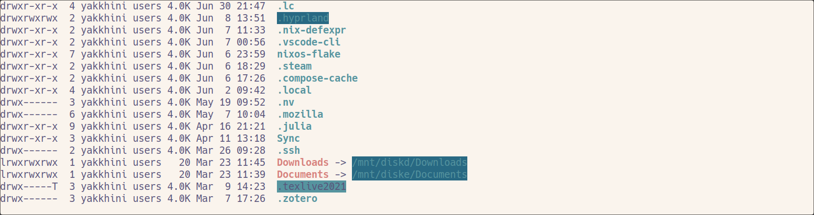

# 2023 年第六届一生一芯学习记录

## 预学习阶段

### 如何科学地提问

见 [我的读后感。](brainFlush/20230813-explore.md)

### Linux 系统安装和基本使用

#### 安装一个 Linux 操作系统

我已经在电脑上安装使用的 [NixOS 发行版](linux/20220629-nix.md) 下进行工作，使用 Linux 也已经有两年多的时间。所以 PA0 对我来说还是比较轻松的。

#### 获取“一生一芯”框架代码

#### 学习 Linux 基本使用

虽然已经与 Linux 打交道了很久，也使用过数种发行版（Ubuntu，Debian，Manjaro，NixOS），但我之前大多都是作为一个用户与常规语言开发者的角度使用 Linux。因此，在这一节中我会学习讲义中 MIT 系列课程并为自己补充一些不太熟悉的知识如编写脚本等，按要求完成习题。

**课程概览与 shell**

我使用 Alacritty 作为终端模拟器，zsh 为日常使用的 Shell。


在 Linux 中，一般使用 `mkdir` 命令创建文件夹。当然也有一些 GUI 或 TUI 的文件浏览器可以交互式地完成这一命令，如我机器上的 nautilus 及 ranger。不过在习惯了命令行操作后，反而会觉得这些方法不如 `mkdir` 轻巧。除此之外，我还遇到过一些稳定性问题。比如在拷贝大文件夹与大数量文件时，图形界面可能会更加不稳定导致复制过程出错，而使用 `cp` 命令则成功地解决了这一问题。

`/tmp` 目录往往用来存储一些临时文件，所以这是一个方便我们练习文件操作的地方。与其类似的是 `/swap` 分区，不过这一分区的作用更大，它会辅助电脑内存进行一些虚拟存储的工作。特别的，在 **Suspend** 模式下，电脑会将除内存条以外的几乎所有硬件断电，而在 **Hibernate** 模式下内存中的数据则被写入硬盘中的 `/swap` 分区，然后将包括内存条内的几乎所有内存断电，达到和关机基本一样的耗电水平。所以说，如果用户对 Linux 的 Hibernate 功能有需求的话，在安装系统时给 `/swap` 分区足够的硬盘空间是有意义的，可以防止在需要电脑休眠省电时 Hibernate 失败。使用命令创建并进入 `missing` 文件夹，可以看到 zsh 为其提供了自动补全。


在 Linux 中想要知道一个命令最完整的帮助，使用 `man` 命令是不错的方法。有许多成熟的软件都配备了完整的文档。如练习中就使用了 `man touch` 来帮助我了解 `touch` 命令。不过一般除了 `man` 命令外，大部分 unix 上的软件都藏着另一个简化版的命令说明书，也就是在命令后直接使用 `help` 参数，或者使用 `-h` `--help` 的 flag 来调出；或者在用户错误地使用命令时自动打印在虚拟终端里。这一说明往往是约定俗成的，也因此没有统一的格式。如 `touch` 命令就使用 `touch --help` 来调用。

```
/tmp/missing 9s
❯ touch --help
Usage: touch [OPTION]... FILE...
Update the access and modification times of each FILE to the current time.

A FILE argument that does not exist is created empty, unless -c or -h
is supplied.

A FILE argument string of - is handled specially and causes touch to
change the times of the file associated with standard output.

Mandatory arguments to long options are mandatory for short options too.
  -a                     change only the access time
  -c, --no-create        do not create any files
  -d, --date=STRING      parse STRING and use it instead of current time
  -f                     (ignored)
  -h, --no-dereference   affect each symbolic link instead of any referenced
                         file (useful only on systems that can change the
                         timestamps of a symlink)
  -m                     change only the modification time
  -r, --reference=FILE   use this file's times instead of current time
  -t STAMP               use [[CC]YY]MMDDhhmm[.ss] instead of current time
      --time=WORD        change the specified time:
                           WORD is access, atime, or use: equivalent to -a
                           WORD is modify or mtime: equivalent to -m
      --help        display this help and exit
      --version     output version information and exit

Note that the -d and -t options accept different time-date formats.

GNU coreutils online help: <https://www.gnu.org/software/coreutils/>
Full documentation <https://www.gnu.org/software/coreutils/touch>
or available locally via: info '(coreutils) touch invocation'

/tmp/missing
❯
```

可以看到，touch 的起名很形象。它本来的作用其实是更新一下其作用文件的最后修改读取日期，也就是什么都不做的同时“摸一下”这些文件，只是附带了创建空文件的功能。如果我们直接用 vim 编辑脚本并保存，也可以达到同样的效果。使用类似 vim 的 Helix 编辑器将脚本写入 `semester`。


需要注意的是第一行的 `#!/bin/zsh`。这一行被叫做 **Shebang**。也就是说当这一文件被赋予可执行权限时，Shebang 行会告诉系统这个文件并不是一个可执行二进制文件，而是需要解释器执行的脚本文件。当然我其实也可以直接用 `zsh ./semester` 来执行这一文件。不过直接这样写会警告，因为我们的 `/bin` 目录下只有 `/bin/sh` 解释器。应当写成 `#!/usr/bin/env zsh`。

直接执行 `./semester` 命令必然会报错。这是因为在 Linux 下编辑保存的文本文件一般都没有执行权限。需要我们主动更改。Linux 下的文件权限针对 所属用户，所属用户组，其他用户分别设了读、写、执行权限，其中三个权限又可以使用一个数字代表。我们最常见的 `chmod 777 filename` 就是给所有相关权限的人授予全部权限，也就是 `rwxrwxrwx`。实际上我们只需要给我们自己执行权限就好。使用 `chmod u+x semester` 为自己更改权限，并在执行时使用管道与流的功能将其输出信息写入目标文件。


经过查找，我发现笔记本电量在 `/sys/class/power_supply/BAT0/capacity` 文件中。

```
~
❯ cat /sys/class/power_supply/BAT0/capacity
100

~
❯

```

**Shell 工具和脚本**

在这部分中我遇到了一些自己不算熟悉的 `bash` 语法。不过依照简单地学习也完成了任务，毕竟编程语言都大同小异。

使用 `ls --help` 查询指令说明，发现 `-a` Flag 可以列出包括隐藏文件的所有文件，`-l` 可以以长格式列出文件，`-h`可以以宜于人类阅读的方式表示文件大小，`-t`可以按照最近访问时间为结果排序。短 Flag 可以叠加，在根目录下使用 `ls -alht` 来按照要求的格式列出文件。



可以看到在结果中不仅展示了隐藏文件，还会展示一些被链接的文件或目录，并将所有文件按最近访问时间排序。

写脚本耗费了我一些时间。按照作业要求编写了 `macro` 与 `polo` 函数来跳转文件目录。

```bash
#!/usr/bin/env zsh

macro() {
  pwd >! /home/yakkhini/Documents/Code/ysyx/01-missing/savedpath
}

polo() {
  targetpath="$(cat /home/yakkhini/Documents/Code/ysyx/01-missing/savedpath)"
  cd $targetpath
}

#if [ $1 == "macro" ]; then
#  macro
#elif [ $1 == "polo" ]
#then
#  polo
#else
#  echo "command error"
#fi
```

实际上还写了一些辅助代码，方便在直接调用脚本时通过参数选择想要使用的功能。不过 `source` 了之后就可以直接在 shell 中调用函数，因此注释掉了这些代码。通过使用函数，我可以方便地在截图目录与工作目录跳转，帮助我处理与复制截图文件。


在 `macro` 函数中，我遇到了重定向的目录信息无法覆写入目标文件的问题。经过排查，发现 bash 环境中这一函数运行正常，而 zsh 环境中这一函数运行失败。通过在相关搜索引擎中通过关键字“shell file exists redirect zsh”搜索相关问题，发现在 [Unix & Linux StackExchange](https://unix.stackexchange.com/questions/212127/zsh-disable-file-exists-warning-with-redirection) 上存在相关问题与回答。通过在重定向符号后加叹号 `>!` 解决了这一问题。zsh 与 bash 语法有差别，我想选择 zsh 开发可以锻炼我的问题解决能力。

而在 `polo` 函数中，我起初不知道如何编写读取文件内存储的目录并传递给 `cd` 命令的代码。我尝试了使用管道 `cat /home/yakkhini/Documents/Code/ysyx/01-missing/savedpath | cd` 但很快发生了错误。在知乎上明白了很有可能是因为 `cd` 命令并不接受管道传来的标准输入，而可以使用 `xargs` 来接受管道标准输入并作为参数传给命令，并通过 `-p` Flag 查看待执行的命令来 Debug。但是 `cat /home/yakkhini/Documents/Code/ysyx/01-missing/savedpath | xargs -p cd` 仍然会报错。我在 [superuser StackExchange](https://superuser.com/questions/206789/using-xargs-to-cd-to-a-directory) 中找到了问题的根源：`xargs` 与 `cd` 都是在进程下执行了一个子进程，而子进程的变化无法传给父进程。也就是说我通过管道与 `xargs` 执行 `cd` 的思路就是错的。因此我转而采用将 `savedpath` 内容保存为字符串变量并直接使用 `cd` 命令的办法来完成这一功能。在了解了使用单引号、双引号与 `$` 转义符的功能后，我完成了脚本的编写，并实现了想要的效果。

有了一定的脚本编写基础后，我编写下一个脚本也熟悉了很多。

```bash
#!/usr/bin/env zsh

echo "stdout:" >! magicnumout
echo "stderr:" >! magicnumerr

runtimes=0
while (( $(wc -l < magicnumerr)==1 ))
do
  ./magicnum.sh >> magicnumout 2>> magicnumerr
  runtimes=$((runtimes+1))
done

cat magicnumout
cat magicnumerr
echo "Run for $runtimes times."
```

我将题目给的脚本放在了 `magicnum.sh` 里，使用脚本调用运行，在报错后停止运行并打印 `stdout` 与 `stderr` 的内容，给出循环次数作为计数。在 Linux Shell 中，标准信息流被分为 **STDIN，STDOUT，STDERR** 三类，也就是标准输入流（一般为键盘），标准输出流，标准错误流，并分别用数字 `0, 1, 2` 指代。在使用信息流重定向时，通过标注数字可以调整其输入输出。

虽然我之前学到的 `xargs` 没有对 `cd` 命令起到作用，但是在下一节的压缩 `html` 文件的练习中很有用。

```bash
~/Documents/Code/ysyx/01-missing
❯ find ~/Documents/Blog -name "*.html" | xargs zip target.zip
  adding: home/yakkhini/Documents/Blog/YeChaNvCinema/docs/index.html (deflated 68%)
  adding: home/yakkhini/Documents/Blog/YeChaNvCinema/node_modules/docsify-cli/lib/template/index.html (deflated 42%)
  adding: home/yakkhini/Documents/Blog/YeChaNvCinema/node_modules/docsify-cli/lib/template/index.local.html (deflated 41%)
  adding: home/yakkhini/Documents/Blog/YeChaNvCinema/node_modules/livereload/examples/index.html (deflated 32%)

~/Documents/Code/ysyx/01-missing
❯ ls
magicnumerr  magicnumloop.sh  magicnumout  magicnum.sh  marco.sh  savedpath  target.zip
```

**编辑器（Vim）**

我已经比较熟练地使用 vim 与宏功能了。

**数据整理**

`grep`，`sed`，`awk` 被称为 Linux 命令行三剑客。将它们通过管道组合可以作出非常强大的文本操作。

**命令行环境**

**版本控制（Git）**

我有通过远程服务器离线下载电影的经验，也有购买与使用个人服务器的经验，因此对于 `ssh` 使用，GnuPG 非对称加密非常熟练。在使用 Git 时，我也保持着约定式提交 git message 与 commit 数字签名的良好习惯，也经历过回退 `reset` 变基 `rebase` 及分支 `branch` 等工作流程，因此对这两章也是比较熟悉的。

### 复习 C 语言 —— Learn C the hard way 练习

0. 准备
1. 启用编译器

在这一练习中我将准备我的 c 语言开发环境，并使用 `make` 命令来编译 `ex1.c` 代码。我计划使用 LLVM / Clang 套件来做 c 语言开发，因此无法按照教程中的引导来完成。安装 `clang-tools` 来获取 clangd 语言服务器，`clang` 作为编译器以及编译要用到的 `gnumake` 软件包。在 NixOS 发行版中比较推荐使用 Clang 来编译 c 与 cpp 文件，自带了 wrapper 来更改 `make` 默认的编译器，并使相关编译工具兼容了 NixOS 非 FHS 的文件系统。因此我可以在使用 Helix 命令行编辑器复制保存示例代码后直接 `make ex1` 命令来编译代码。

```
~/Documents/Code/ysyx/03-hardwayc
❯ cc --version
clang version 11.1.0
Target: x86_64-unknown-linux-gnu
Thread model: posix
InstalledDir: /nix/store/a1bf9m79xr32a55idbbjbjpylp1xphag-clang-11.1.0/bin

~/Documents/Code/ysyx/03-hardwayc
❯ make ex1
cc -Wall -g    ex1.c   -o ex1

```

4. Valgrind 介绍

完成练习 4 时，我发现学习文章中的源码网址已经过期。新的 Valgrind 下载连接被移动到了其他地方。除此之外，`3.6.1` 版本已经无法在我的 Linux 内核环境（6.1）下编译。因此我改用了 `3.21.0` 版本，并依照其 GitHub 仓库的编译说明为 `./configure` 命令增加了 `--prefix` Flag，来命令程序安装在工作目录下而不是全局。

```bash
# 更改了版本与下载网址
curl -O https://sourceware.org/pub/valgrind/valgrind-3.21.0.tar.bz2
tar -xjvf valgrind-3.21.0.tar.bz2

cd valgrind-3.21.0
./configure --prefix=/home/yakkhini/Documents/Code/ysyx/03-hardwayc/ex4/bin # 更改了安装目录以避免安装时需要 Root 权限

make
make install
```

回到目标目录下发现已经安装好的 Valgrind，并可以运行。

```
~/Documents/Code/ysyx/03-hardwayc/ex4
❯ ls
bin  valgrind-3.21.0  valgrind-3.6.1  valgrind-3.21.0.tar.bz2  valgrind-3.6.1.tar.bz2

~/Documents/Code/ysyx/03-hardwayc/ex4
❯ ./bin/bin/valgrind --version
valgrind-3.21.0
```

经编译与使用 Valgrind，可以对写好的 c 代码 Debug。需要注意的是，只有在编译时 `CFLAGS` 包含 `-c` 才会输出源代码行号。我还是保持着使用 Makefile 编译的习惯，将相关代码写入 `all` 与 `clean` 区域。修改代码很简单，只要对第一句 `printf` 语句后增加 `age` 变量供正则转换，并为 `height` 代码初始化时赋值就可以使程序正常运行了。

```
~/Documents/Code/ysyx/03-hardwayc 26s
❯ make
cc -Wall -g    ex4/ex4.c   -o ex4/ex4
ex4/ex4.c:9:17: warning: more '%' conversions than data arguments [-Wformat]
  printf("I am %d years old.\n");
               ~^
ex4/ex4.c:7:7: warning: unused variable 'age' [-Wunused-variable]
  int age = 18;
      ^
ex4/ex4.c:10:36: warning: variable 'height' is uninitialized when used here [-Wuninitialized]
  printf("I am %d inches tall.\n", height);
                                   ^~~~~~
ex4/ex4.c:8:13: note: initialize the variable 'height' to silence this warning
  int height;
            ^
             = 0
3 warnings generated.
cc -Wall -g    ex4/ex4fix.c   -o ex4/ex4fix

~/Documents/Code/ysyx/03-hardwayc
❯ cd ex4/

~/Documents/Code/ysyx/03-hardwayc/ex4
❯ bin/bin/valgrind --track-origins=yes ./ex4fix
==5861== Memcheck, a memory error detector
==5861== Copyright (C) 2002-2022, and GNU GPL'd, by Julian Seward et al.
==5861== Using Valgrind-3.21.0 and LibVEX; rerun with -h for copyright info
==5861== Command: ./ex4fix
==5861==
I am 18 years old.
I am 178 inches tall.
==5861==
==5861== HEAP SUMMARY:
==5861==     in use at exit: 0 bytes in 0 blocks
==5861==   total heap usage: 1 allocs, 1 frees, 1,024 bytes allocated
==5861==
==5861== All heap blocks were freed -- no leaks are possible
==5861==
==5861== For lists of detected and suppressed errors, rerun with: -s
==5861== ERROR SUMMARY: 0 errors from 0 contexts (suppressed: 0 from 0)

~/Documents/Code/ysyx/03-hardwayc
❯ make clean
rm -f ex1
rm -f ex3
rm -f ex4/ex4
rm -f ex4/ex4fix

```

在搜集资料时我习惯分别搜集中文与英文资料。搜集中文资料时我会在知乎上搜索关键词，看看是否有爱好者对相关内容作出评价。对于 Valgrind，我比较感兴趣的是它是否属于 C 语言工具链中较新或者未过时的工具，以及有无替代品或与其配合的其他工具。在英文资料中，我搜集的类似内容比较喜欢从 Arch Wiki 上入手。除此之外，我肯定还要去 Valgrind 的官网查看有用的相关信息。

经搜索，知乎上只有几篇对 Valgrind 介绍的资料，我并不感兴趣。其中绝大部分是营销号与英文资料的翻录，即使是个人博客也仅仅介绍其基础使用，没有我期待的相关评价。在 Arch Wiki 上，我找到了 [Debugging](https://wiki.archlinux.org/title/Debugging) 页面，介绍了除 Valgrind 外还有的 Gdb 工具，以及寻找缺失文件与库的工具。对后者我感到非常有用，因为我的 NixOS 系统由于不是传统的 FHS 文件系统，所以许多下载的二进制文件需要 `patchelf` 手动挂载相关库才能运行，而后面的一些工具可能会使这一过程更便捷，使我更快确定到底缺失了哪些库。除此之外，还有特别的对于 Linux 上 C 语言介绍的 [C](https://wiki.archlinux.org/title/C) 页面，我想在未来遇到其他问题时这些都是潜在的寻找资料的地方。在 Valgrind 官网上，我认为左侧栏中的 [Valgrind's Tool Suite](https://valgrind.org/info/tools.html) 页面可以帮助我对 Valgrind 的内容大概了解，而 [Valgrind Documentation](https://valgrind.org/docs/manual/index.html) 则可以在以后深入使用 Valgrind 时去查阅。

寻找另一个可以编译的软件，我想到了 [Aseprite](https://www.aseprite.org/)，一个像素画工具。它如果直接下载使用需要付费，而如果自己编译则可以免费使用。它的源码部署在 [GitHub 仓库](https://github.com/aseprite/aseprite/) 里。在 Shell 中临时安装了 `cmake` 与 `ninja` 依赖后，运行文档命令发现本地缺失 `libc++` 库。通过 NixOS Official 的软件包查询发现该库在 NixOS 中的名称为 `libcxx`。

### 搭建 verilator 仿真环境

我不想让脚本随意更改我的 `~/.bashrc`，实际上在 NixOS 中也无权更改。所以使用 `direnv` 让进入工作目录时自动挂上脚本中需要的 `NPC_HOME` 环境变量。除此之外，`5.008` 版本的 verilator 已经被保存在 nixpkgs 仓库的历史 commit 中。我在 GitHub 中找到了其存在的 nixpkgs Git 版本，并写入 Flake 的 inputs 中，在 `mkShell` 里声明依赖。在根目录下写 `flake.nix`，并将 `flake.lock` 移出 `.gitignore`。

```nix
{
  description = "Flake for ysyx";
  inputs = {
    verilator5008pkgs.url = "github:NixOS/nixpkgs/5e871533c4a488319b9cb98d7a525c356459d36c";
    pkgs.url = "pkgs";
  };
  outputs = {
    self,
    pkgs,
    verilator5008pkgs,
  }: let
    stdpkgs = pkgs.legacyPackages.x86_64-linux;
  in {
    formatter.x86_64-linux = pkgs.legacyPackages.x86_64-linux.alejandra;
    devShells.x86_64-linux.default = pkgs.legacyPackages.x86_64-linux.mkShell {
      name = "ysyx-shell";
      packages = [
        verilator5008pkgs.legacyPackages.x86_64-linux.verilator
        stdpkgs.gtkwave
        stdpkgs.bison
        stdpkgs.flex
        stdpkgs.ncurses
        stdpkgs.readline
        stdpkgs.llvm
        stdpkgs.gdb
        stdpkgs.python3
      ];

      buildInputs = with stdpkgs; [
        gnumake
        SDL2
        SDL2_image
        pkg-config
      ];

      shellHook = ''
        export NPC_HOME=`readlink -f npc`
        export NEMU_HOME=`readlink -f nemu`
        export AM_HOME=`readlink -f abstract-machine`
        export NVBOARD_HOME=`readlink -f nvboard`
      '';
    };
  };
}
```

编译 NVBOARD 时遇到了 SDL 相关头文件无法 `include` 的问题。使用 `pkg-config` 来修补 `NIX_CFLAGS_COMPILE` 环境变量。更改 `flake.nix`：

```nix
...
shellHook = ''
        export NPC_HOME=`readlink -f npc`
        export NEMU_HOME=`readlink -f nemu`
        export AM_HOME=`readlink -f abstract-machine`
        export NVBOARD_HOME=`readlink -f nvboard`
        NIX_CFLAGS_COMPILE="$(pkg-config --cflags sdl2) $NIX_CFLAGS_COMPILE"
      '';
...
```

### PA1 实验报告

#### 程序是个状态机

经过分析我认为状态机会以以下顺序进行。其中 `pc` 值存储在第一个分量中，代表着下一条要执行的指令。第二个和第三个分量代表着 `r1` 和 `r2`存储器的值。

```sh
(0, x, x) -> (1, 0, x) -> (2, 0, 0) -> (3, 0, 1) -> (4, 1, 1)
-> (2, 1, 1) -> (3, 1, 2) -> (4, 3, 3) -> etc.
-> (3, 4851, 99) -> (4, 4950, 99) -> (2, 4950, 99) -> (3, 4950, 100)
-> (4, 5050, 100) -> (4, 5050, 101) -> (5, 5050, 101)
-> (5, 5050, 101) -> INFINITE LOOP AND STOP IN THIS STATE
```

#### 理解基础设施

计算使用 GDB 调试时间：

$$500 \times 90\% \times 30 \times 20 = 270000 \ Seconds$$

也就是 4500 分钟，约为 75 个小时。

当实现了 Simple Debugger 后：

$$500 \times 90\% \times 10 \times 20 = 90000 \ Seconds$$

也就是 1500 分钟，25 个小时，仅为前者的三分之一。


#### RTFM - RISC-V Manual

在读 Manual 之前，我首先阅读了计算所团队翻译的 [RISC-V 手册](http://riscvbook.com/chinese/) 的第一章，了解了 RISC-V 模块化指令集的理念。这解决了我对 Manual 中充满了「Extension」字样的困惑，明白了它们是模块化的扩展指令集。实际上在中文手册前的参考卡片里就可以迅速看出 RISC-V 指令的各个类型了，不过我还是想去官方 Manual 里再查阅一下。

所以首先 RISC-V 指令类型可以分为基础指令集和扩展指令集。一类特殊的扩展指令集是标准扩展，它们与基础指令集合并后构成一般指令集（RV32G，G for General）。这些部分可以在 Manual 1.3 Overview 章节看到。除此之外，我认为通过手册目录也可以看得很清楚。

`LUI` 指令就在 2.6 节的 Integer Register-Immediate Instructions 小结中。它的意思是 load upper immediate，将 U 立即数读入寄存器。当然，它是一个 U-type 指令。这些信息在 2.2 节和 2.3 节。

`mstatus` 寄存器的信息则应当去第二卷手册中寻找，因为第一卷内容主要讲的是指令与指令集及相关寄存器。它属于 CSR，并且与特权级指令有关。在第 10 页查到 `mstatus` 的特权级为 MRW。具体信息则在 3.1.6 节中写明。


#### Shell 命令

我使用 `cloc` 工具统计代码行数，比较方便。

```sh
nix shell "pkgs#cloc
cloc ./
```

**OUTPUT：**

```
206 text files.
     183 unique files.
     127 files ignored.

github.com/AlDanial/cloc v 1.96  T=8.18 s (22.4 files/s, 3437.2 lines/s)
-------------------------------------------------------------------------------
Language                     files          blank        comment           code
-------------------------------------------------------------------------------
C                               69           2828           2662          15948
C/C++ Header                    35            384            793           1545
JSON                             1              0              0            955
D                               51             81             27            602
yacc                             1            106             25            596
lex                              1             61             24            386
make                            16             85            198            258
Markdown                         4             45              0            221
C++                              2             30             28            182
Text                             1              0              0             14
DOS Batch                        1              3              0              8
Assembly                         1              1             16              5
-------------------------------------------------------------------------------
SUM:                           183           3624           3773          20720
-------------------------------------------------------------------------------
```

当然 `cloc` 也有 Compare 功能来比较两个 Git Commits 之间的差异。其中可以用 Commit Hash，不过我就使用 Git Branch 来比较了。

```sh
cloc --git-diff-all master pa1
```

**OUTPUT：**

```
142 text files.
     142 text files.
      34 files ignored.

github.com/AlDanial/cloc v 1.96  T=0.35 s (357.6 files/s, 55108.6 lines/s)
-------------------------------------------------------------------------------
Language                     files          blank        comment           code
-------------------------------------------------------------------------------
C
 same                           60           1626           1917          10405
 modified                        7              0             72             68
 added                           0             24             12            442
 removed                         0              0              1             10
C/C++ Header
 same                           32            357            741           1414
 modified                        0              0              0              0
 added                           1              7             15             17
 removed                         1              4             14              5
yacc
 same                            1            106             25            596
 modified                        0              0              0              0
 added                           0              0              0              0
 removed                         0              0              0              0
lex
 same                            1             61             24            386
 modified                        0              0              0              0
 added                           0              0              0              0
 removed                         0              0              0              0
make
 same                           16             85            198            258
 modified                        0              0              0              0
 added                           0              0              0              0
 removed                         0              0              0              0
Markdown
 same                            4             45              0            221
 modified                        0              0              0              0
 added                           0              0              0              0
 removed                         0              0              0              0
C++
 same                            2             30             28            182
 modified                        0              0              0              0
 added                           0              0              0              0
 removed                         0              0              0              0
Assembly
 same                            1              1             16              5
 modified                        0              0              0              0
 added                           0              0              0              0
 removed                         0              0              0              0
-------------------------------------------------------------------------------
SUM:
 same                          117           2311           2949          13467
 modified                        7              0             72             68
 added                           1             31             27            459
 removed                         1              4             15             15
-------------------------------------------------------------------------------
```

我在 PA2 中修改涉及 9 个文件，不考虑空行与注释则新增了 459 行代码，修改了 68 行代码。

#### RTFM - GCC Flags

`-Wall` 命令指的是启用 GCC 中所有不适宜的警告，`-Werror` 指的是将所有警告都转换为 ERROR 报错。除此之外，其实也可以通过 `-Werror=[Warning Class]` 来将 Warning 转换为 Error。这样可以增加程序的稳定性，避免潜在的不希望的表现，是「任其崩溃」思想的一种体现。我在 PA1 中表达式生成器的部分就使用了 `-Werror` 来过滤溢出和除零的表达式。

## 基础阶段 - B Stage

### PA2 实验报告

#### 程序是个状态机

在 YEMU 中，执行一条指令的过程也就是取指——译码——执行的过程。每一次循环都会进入 `exec_once()` 函数模拟 CPU 的一次执行过程。在进入 `exec_once()` 后，CPU 首先将初始化一个 `isst_t` 变量，这个变量作为 Union 可以赋值为 R-type，M-type 指令，也可以单纯作为一个 8 位立即数。在取指后通过 `switch` 语句来识别操作码。虽然是使用了 `this.rtype.op` 来取操作码，不过由于 R-type 和 M-type 操作码在指令中位置相同，所以可以通用，在 `case` 中进一步分流。

`switch` 语句根据不同的操作数来分辨指令的格式，并进行译码。R-type 类型指令通过 `DECODE_R` 来译码，而 M-type 指令通过 `DECODE_M` 来译码。译码的结果会是寄存器位置（R-type）或者内存位置（M-type），程序可以通过这些秩来访问存在 `R` 数组中的寄存器或者是 `M` 数组中的内存数据。这两个数组被用来模拟寄存器组和内存。接着就会对寄存器或内存中取的数执行相应的操作，如赋值、相加等。最后让 `pc` 全局变量自增，代表着在下一次循环中执行新的指令。

在执行完 `store 7#` 指令后，程序模拟的 CPU 将计算完成存储在 `R[0]` 也就是 `r0` 寄存器的值写入内存中，覆盖原有的 `0b00000000` 八位零值。实际上此时程序就结束了，不过 `pc` 依然会自增，并进入下一个循环。在下一个循环中 CPU 尝试取指，此时取到了存储在 `M[5]` 处的值。这实际上不是一个指令，而是我们存储的 `x` 变量的数值，也就是 `16`。下一步在判断操作数时，会将其视作一个指令并取前 4 位操作码位判断。此时发现 `0001` 符合 `add` 指令格式，并将 `r0` 寄存器内的值自己相加变成两倍。这实际上是一个巧合，而在下一次取指中就没那么幸运了，`M[6]` 处的数值 `y` 前 4 位 `0010` 不属于任何操作数，此时程序报错并将 `halt` 变量设为 `1`，然后退出 `exec_once()` 函数。此时循环也因触发 `halt` 而退出循环。

所以说，以我的理解来看这里的代码存在一个小缺陷，也就是说 CPU 对于指令数据和非指令数据无法判断。幸运的是这里的非指令数据虽然执行了一条，但是没有对 `M[7]` 内存储的数值产生影响，因此没有破坏程序的正确性。但是并不是每一次都可以这样。想要避免这种错误应该会有一些特殊的手段，令我联想到了 `nemu` 项目中指令程序的 `0xdeadbeef` 数据。我猜测或许这个虚假指令就是用来退出 CPU 执行过程的。

依照 PA1 第一题的格式，绘出程序的状态机，其格式为（pc, r0, r1, M[7]）：

```sh
M[5] = 16; M[6] = 33; # Didn't change in execution.
(0, x, x, 8d0) -> (1, 33, x, 8d0) -> (2, 33, 33, 8d0) -> (3, 16, 33, 8d0)
-> (4, 49, 33, 8d0) -> (6, 49, 33, 8d49)
-> (6, 98, 33, 8d49) # Unexpected status.
```

注意，最后一个状态 `(6, 98, 33, 8d49)` 是将 M[5] 处的数值当作指令执行的结果，也就是不想要的一个状态。