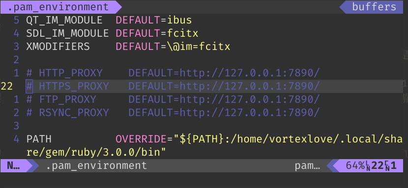
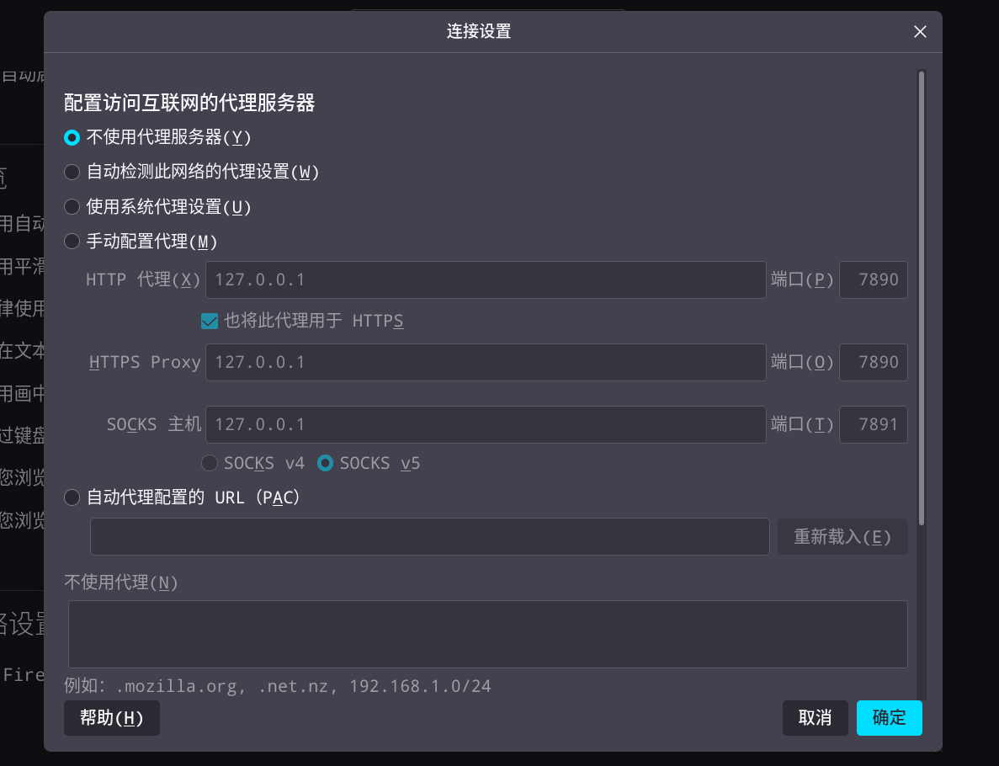

# 使用 Clash TUN Mode 在本机上实现透明代理

## linux 的 proxy 设置

linux 中自带了一套[在环境变量中配置代理](https://wiki.archlinux.org/title/Proxy_server#Environment_variables)的办法。以我的配置文件为例：



当然，现在它们已经被注释掉了。这样的代理设置方法好处是比较简便，但是也有两个缺点。

### 1. 环境变量形式的代理会需要应用检测到，才能起作用

刚接触环境变量的人或许觉得这个东西不好理解，很麻烦。不过本质上， **环境变量与其他变量并没有区别。** 在应用程序运行的时候，每时每刻都在处理各种变量。唯一不同的是，这其中大部分的变量都由程序内部定义或生成，而环境变量是外部天然存在的。例如，在程序运行时，你会需要什么输入法被唤醒？你的系统中使用 A 组件帮助程序运行，还是 B 组件？这都是程序自己没办法知道的事，需要系统来告诉它。系统变量就是其中一个方便的沟通办法。

我在 linux 上习惯使用 firefox 作为浏览器，因为 chrome 对环境变量的支持有些粗糙。我们来观察一下 firefox 的代理设置界面。



如果使用了环境变量，那么在这个界面中选择「使用系统代理设置」，就可以启用你的配置。同样的，若选择「不使用代理服务器」，则 firefox 会忽视你的环境变量，并采用直接连接的方式来处理网络请求。这一机理的背后，反应了一个事实，即 **你若采用环境变量的方式配置代理，则应用会凌驾于你的代理设置之上。** 如果这一应用不读取你的代理设置，它就不会起作用——当然在如今这种情况是很少见的。不过有些程序会特定选择大写或小写字母版本的环境变量，比如你还需要定义形如`http_proxy`的环境变量。

不管怎样，按我们的逻辑来说大家更喜欢接管应用网络流量的代理方式，这样也更符合直觉。在你对代理需求不高或者刚上手 linux 的情况下，设置环境变量也不失为一个好选择。在百分之九十的时候，它都会起作用。

### 2.环境变量的代理形式是应用层协议，且往往不支持 socks proxy

在上图中我们看到，环境变量设置 proxy 的办法主要支持 http, https 协议（其余两个用不太多，不多介绍）。而这两者都是基于 tcp 的进一步封装。有些人会额外定义一个`socks5_proxy`变量，其作用大概聊胜于无。这是一个不错的想法，因为 socks5 除了接受 tcp 协议外也接受 udp 协议。但是如 arch wiki 中所写，你如果真的想用 socks5 代理，除了支持处理它的应用可以手动配置外，只能 **尝试** 使用 tsocks 或 proxychains-ng 等应用。但是这类软件在实际使用上体验不太好。

所以，我们理想中的代理是这样的：它能接管整个网络流量，不必在乎应用的感受；也不挑食，能把所有的 tcp 和 udp 连接一股脑转给代理。幸运的是，linux 的网络配置能力很强大，市面上路由器的系统一般都是 linux，包括你家里那台。而这种代理的方式也有人研究过，这就是 **透明代理** 。

透明代理，顾名思义就是 **让应用不知道自己被代理了。**想要实现透明代理，Clash 有 tproxy 的功能，可以搭配 nftables 来配置。但是由于这个配置很复杂，我们采用了另一方案——**Clash-Premium 的 TUN Mode 功能。**

## TUN Mode

TUN（network TUNnel）和 TAP（network TAP）都指的是一种虚拟网络设备，集成于 Linux 内核中。前者模拟的是一种网络层设备，用于处理 ip 协议的数据包，后者模拟的是链路层设备，可以处理以太帧。好在我们使用 Clash 时，它会自动配置这些东西，不必我们操心。

### 安装 clash-premium

闭源版 Clash 不一定在各种发行版与包管理器的发行版中找到，好在我使用的 NixOS 中 NUR 软件源里有 clash-premium。

```nix
...
environment.systemPackages = with pkgs; [
    ...
    config.nur.repos.linyinfeng.clash-premium
    ...
  ];
...
```

`nixos-rebuild` 后我们就有了一个拥有闭源 Clash 的系统。

### Clash 配置

使用 Clash 配置 TUN 可以在 [Clash 文档中](https://github.com/Dreamacro/clash/wiki/Clash-Premium-Features) 找到。

我把我的部分配置贴在这里：

```yaml
mode: rule
tun:
  enable: true
  stack: system
  dns-hijack:
  - 8.8.8.8:53
  - tcp://8.8.8.8:53
  - any:53
  - tcp://any:53
  auto-redir: true
  auto-route: true
  auto-detect-interface: true
dns:
  enable: true
  ipv6: false
  listen: 0.0.0.0:1053
  enhanced-mode: fake-ip
  fake-ip-range: 198.18.0.1/16
  nameserver:
  - https://223.5.5.5/dns-query
  - https://doh.pub/dns-query
  - tls://doh.pub:853
  fallback:
  - tls://1.1.1.1:853
  - https://1.1.1.1/dns-query
  - https://1.0.0.1/dns-query
  - https://8.8.8.8/dns-query
  fallback-filter:
    geoip: true
    geoip-code: CN
log-level: debug
external-controller: 127.0.0.1:9090
...
```

### Clash Service

然后我们配置一个 Service Unit，让 systemd 自动以 root 权限运行 clash-premium 的守护程序。

在 NixOS configuration 中写：

```nix
  ...
  # Clash deamon service
  systemd.services.clash-daemon = {
    enable = true;
    description = "Clash daemon, A rule-based proxy in Go.";
    after = ["network.target"];
    serviceConfig = {
      Type = "simple";
      Restart = "always";
      ExecStart = "${config.nur.repos.linyinfeng.clash-premium}/bin/clash-premium -d /home/yakkhini/.config/clash";
    };
    wantedBy = ["multi-user.target"];
  };
  ...
```
rebuild 后，观察这个 service：

```
[Unit]

[Unit]
After=network.target
Description=Clash daemon, A rule-based proxy in Go.

[Service]
Environment="LOCALE_ARCHIVE=/nix/store/35barlpq8p2ykvzx1n194cbzil5c973k-glibc-locales-2.35-224/lib/locale/locale-archive"
Environment="PATH=/nix/store/ngw3m00r391w31n13q4m2x06amx4mqri-coreutils-9.1/bin:/nix/store/vmm828xyvm8pjwjbx33n7z9r45vv1lk3-findutils-4.9.0/bin:/nix/store/njz77ksdp38vy6wyb9bq70dzfjxm5im0-gnugrep-3.7/bin:/nix/store/scmjiz80b1hh521k06z4fgbkl6r5k84p-gnused-4.8/bin:/nix/store/sf1qmjj1im2xnmdvcpghq2h5b06z5rz2-systemd-251.7/bin:/nix/store/ngw3m00r391w31n13q4m2x06amx4mqri-coreutils-9.1/sbin:/nix/store/vmm828xyvm8pjwjbx33n7z9r45vv1lk3-findutils-4.9.0/sbin:/nix/store/njz77ksdp38vy6wyb9bq70dzfjxm5im0-gnugrep-3.7/sbin:/nix/store/scmjiz80b1hh521k06z4fgbkl6r5k84p-gnused-4.8/sbin:/nix/store/sf1qmjj1im2xnmdvcpghq2h5b06z5rz2-systemd-251.7/sbin"
Environment="TZDIR=/nix/store/p9h078icxj3axz7f6vxyb1jmi2yx94wa-tzdata-2022g/share/zoneinfo"


ExecStart=/nix/store/3ax6d872y8f3rh0pvxrrq0kmzivfaxyb-clash-premium-2022.11.25/bin/clash-premium -d /home/yakkhini/.config/clash
Restart=always
Type=simple

```

因为我使用 NixOS 所以 Service 文件看起来有些复杂。你同样可以在 Clash 文档中找到 [示例写法。](https://github.com/Dreamacro/clash/wiki/Running-Clash-as-a-service)

现在我观察到浏览器等不需要配置 proxy 也能 ping 通国外网站了，透明代理配置成功。

# nftables, clash, dns，透明代理那些事

> **Deprecated Warning: 此内容已过时，请使用 TUN Mode 实现透明代理。**

在本文中，你可以看到以下内容：

* 什么是透明代理？为什么要使用透明代理？
* nftables 的使用，linux 网络机制和代理机制
* dns 污染，DoH、DoT 是什么
* clash 的完全配置解析
* ~~爆破鬼才吉格斯的符文选择及出装思路~~

2021 年秋冬交际，我身体里的电竞之魂突然觉醒，迷上了英雄联盟这个奇妙的游戏。在 linux 上，其实很多游戏的优化都做到不错（至少可玩）的程度了，而英雄联盟除了国服以外的大多其他国家的服务器都被正常适配。

具体如何安装运行，你可以在[lutris 的英雄联盟板块](https://lutris.net/games/league-of-legends/)上查阅，由于不是本篇文章叙述的重点，不再多讲。

但是在游戏过程中，这样的情况出现了：我可以正常进入游戏，但是在局内的操作存在严重的延迟现象。虽然界面右上角显示的延迟在 120 毫秒左右，但技能和走位指令发出后往往要等 1, 2 秒甚至 3, 4 秒。经过初步猜测，这一问题的原因可能是 **环境变量配置的 proxy 无法代理 udp 包，** 甚至无法传进以 wine 为基础运行的游戏。

## linux 的 proxy 设置

linux 中自带了一套[在环境变量中配置代理](https://wiki.archlinux.org/title/Proxy_server#Environment_variables)的办法。以我的配置文件为例：


当然，现在它们已经被注释掉了。这样的代理设置方法好处是比较简便，但是也有两个缺点。

### 1. 环境变量形式的代理会需要应用检测到，才能起作用

刚接触环境变量的人或许觉得这个东西不好理解，很麻烦。不过本质上， **环境变量与其他变量并没有区别。** 在应用程序运行的时候，每时每刻都在处理各种变量。唯一不同的是，这其中大部分的变量都由程序内部定义或生成，而环境变量是外部天然存在的。例如，在程序运行时，你会需要什么输入法被唤醒？你的系统中使用 A 组件帮助程序运行，还是 B 组件？这都是程序自己没办法知道的事，需要系统来告诉它。系统变量就是其中一个方便的沟通办法。

我在 linux 上习惯使用 firefox 作为浏览器，因为 chrome 对环境变量的支持有些粗糙。我们来观察一下 firefox 的代理设置界面。


如果使用了环境变量，那么在这个界面中选择「使用系统代理设置」，就可以启用你的配置。同样的，若选择「不使用代理服务器」，则 firefox 会忽视你的环境变量，并采用直接连接的方式来处理网络请求。这一机理的背后，反应了一个事实，即 **你若采用环境变量的方式配置代理，则应用会凌驾于你的代理设置之上。** 如果这一应用不读取你的代理设置，它就不会起作用——当然在如今这种情况是很少见的。不过有些程序会特定选择大写或小写字母版本的环境变量，比如你还需要定义形如`http_proxy`的环境变量。

不管怎样，按我们的逻辑来说大家更喜欢接管应用网络流量的代理方式，这样也更符合直觉。在你对代理需求不高或者刚上手 linux 的情况下，设置环境变量也不失为一个好选择。在百分之九十的时候，它都会起作用。

### 2.环境变量的代理形式是应用层协议，且往往不支持 socks proxy

在上图中我们看到，环境变量设置 proxy 的办法主要支持 http, https 协议（其余两个用不太多，不多介绍）。而这两者都是基于 tcp 的进一步封装。有些人会额外定义一个`socks5_proxy`变量，其作用大概聊胜于无。这是一个不错的想法，因为 socks5 除了接受 tcp 协议外也接受 udp 协议。但是如 arch wiki 中所写，你如果真的想用 socks5 代理，除了支持处理它的应用可以手动配置外，只能 **尝试** 使用 tsocks 或 proxychains-ng 等应用。我的建议是你别用了，我用过，不太好用。

至此，我们一开始的困惑解决了。大多数网络游戏的实时连接机制都是 udp 协议，不在乎数据包能否保障接受和发送，而更注重速度。峡谷上的操作瞬息万变，如果你和人抢龙，拼惩戒，还要什么“七次握手”，谁能受的了？同样的，我们的代理只能处理 http、https 协议，看到 udp 包时往往爱莫能助。

所以，我们理想中的代理是这样的：它能接管整个网络流量，不必在乎应用的感受；也不挑食，能把所有的 tcp 和 udp 连接一股脑转给代理。幸运的是，linux 的网络配置能力很强大，市面上路由器的系统一般都是 linux，包括你家里那台。而这种代理的方式也有人研究过，这就是 **透明代理** 。

## nftables 的使用

透明代理中“透明”的意思，就是这一代理不会被应用感知到。一般我们会将透明代理部署到路由器或者一台与路由器连接的 linux 主机上，这就是你在网络上找的一些配置方式不管用的原因。本篇文章的教程中，透明代理被设置在 **本机** 上。我们使用的工具是 Netfilter，一个用于管理网络数据包的软件框架。不过由于它位于 linux 内核中，所以我们一般不能直接操作它，而要利用运行在用户空间的应用来与它沟通。使用比较广泛的是 iptables，不过我们不会使用它，而使用另一个工具——nftables. 其实这两者的作用大致相当，不过 nftables 较新，是用于取代 iptables 的一个新工具。

使用 nftables，我们先大致了解一下这张图：


图有点复杂，不过我们不用害怕。在本案例中，我们仅就 Application Layer 和 Ip Layer 进行讨论，即图中黄色和绿色的部分。这张图要表示的，就是数据包在 linux 系统中流动的过程。如图中所示，所有要访问我们系统的 ip packets 会先抵达 Prerouting 节点，之后系统会判断它是否要进行下一步转发。如在路由器中，许多访问它的数据包的最终目的地是连接于它的电脑，这些数据就会进入 Forward 节点。不过我们使用的是个人主机，所以你可以先忽略它，假设所有的数据包都进入到 Input 节点，再传入应用层，被电脑上的应用，如 firefox, clash 等程序接收。而一个应用程序想要发出数据包，就先进入 Output 节点，再与之前 Forward 传出的数据包会合进入 Postrouting 节点，准备发出到互联网。

这一个个节点，就是我们用来操作数据包的机会。所以它们会被叫做 Hook，即“钩子”，你写的对数据包的操作规则 (Rules) 像是一条条小鱼一样咬住特定的钩子和饵，被唤起执行。异步编程中也有关于 Hook 的概念，你可以使用这个形象的比喻来理解它。在一些说唱音乐中，参插在说唱歌词段 (Verse) 中的旋律歌词也被叫 Hook，我猜测是因为它们都很抓耳，容易钩到听众的耳朵。你听完一首陌生的说唱，可能不会对 Verse 记忆多深，但经常会记着或者能哼出来其中的旋律歌词部分，对不？

除了 Hook 概念，在 nftables 中你需要直到的东西还有表 (Table), 链 (Chain). 在 nftables 的配置文件中，chains 被包含在 tables 中，而 chains 中则排列着一条条 rules，三者井然有序地发挥着作用。

```nftables
table ip love {
    chain my_heart {
        type nat hook output priority filter; policy accept;
        love dperson you return
        love dperson others redirect to :you
    }
}

```

我们一步一步解释。首先我们建立了一个叫做 love 的 table，这个 table 所作用的 family 是 ip. 在 nftables 中有很多 family，如 ip, inet, bridge, arp 等。它们可以帮助选择需要被操作的数据包属于 **网络层** 中的哪种协议类型。我们最终想代理的是 **传输层** 中的 tcp, udp 协议连接，这对应着传输层中的 ip 协议。在 nftables 中，ip family 特指 ipv4 连接，ipv6 会被 ip6 family 命中。你也可以使用 inet family 来同时命中这两者。我的电脑及路由设备上没有配置 ipv6，所以 ip 类型的 table 就够用了。 **如果你想配置 ipv6 的代理，注意不能简单地改成 ip6 或者 inet family，** 原因我们后面陆续会讲。
