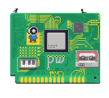
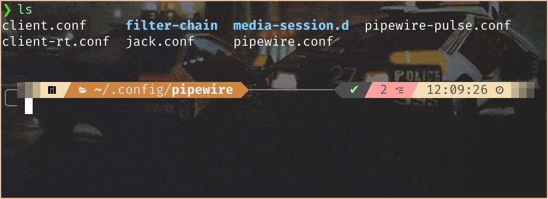

# PipeWire 到底在做什么？

!> *「As of mid 2022, PipeWire is **still in active development.** Some things may still not be fully integrated, tested, or implemented, and there may be large changes. It can work well for some, though the experience is **not guaranteed to be perfect, free of issues, or bugs.」***    
—— PipeWire - Gentoo Wiki

## 引入

从 Pulse Audio 转到 PipeWire 已经快一年了。我之前折腾过如何在 Linux 上做一个方便的多屏协同功能，使用了 Scrcpy, Syncthing, KDE Connect 与 Pulse Audio 达到了与手机屏幕分享、文件同步、音频接交的高度协同效果。今年初，我还使用了 Termux 和 Zerotier 软件让手机随时随地 ssh 电脑，使手机和电脑的互动更加丰富。

但这其中有一个小插曲，就是在去年年中的时候我使用了 PipeWire 代替了 Pulse Audio。这是因为在 Arch wiki 上看到的介绍：

> *PipeWire is a new low-level multimedia framework. It aims to offer capture and playback for **both audio and video** with minimal latency and support for **PulseAudio, JACK, ALSA and GStreamer-based applications.***

结合我的实际使用体验，PipeWire 具有两点优势：

1. 除了处理音频，它还为 Wayland 提供了屏幕捕获功能。目前 Wayland 已经处于完全可用状态，软件生态体验比较良好了。我使用 OBS studio 直播的时候其内置的屏幕捕获功能就是依靠 PipeWire 功能实现的。
2. PipeWire 接管了 Pulse Audio 和 Jack。所以转到 PipeWire 对那些仍在使用其他音频服务的应用来说基本没什么影响。

除此之外，作为一个更新的音频服务框架，我是乐于使用它的。这样可以体验到 Linux 桌面生态最前线的使用体验。

~~而且 PipeWire 官网的像素风很好看~~

准确地讲，PipeWire 对自身的定位是一个多媒体框架（multimedia framework），而并非单纯的音频服务框架，提供了对图像的低开销处理、灵活的媒体格式沟通及缓存分配、具备硬实时能力的的插件，以及延迟非常低的音频视频处理能力。

除此之外，在专业音频领域，使用 PipeWire 也是一个值得考虑的选择，因为它对音频管线的处理能力有了更细的粒度。我在油管上关注的一位 Linux 音乐艺术家 unfa 就发表了一个视频，表示他使用 PipeWire 取代了 Jack 后发现的那些更强大的功能：

[*I've replaced JACK and PulseAudio with PipeWire and this is what happened - YouTube*](https://www.youtube.com/watch?v=q7XrrBXIzfg)

在视频中可以看到，PipeWire 更细的操作粒度使它在面对那些接入多个音频设备后声音工作环境的配置得心应手。

但是问题也出在这里。PipeWire 固然强大，但是它的配置也因而更加复杂。进一步说，我认为是 PipeWire 对自身的定位出了问题。无论从它的用途，或者在 Wiki 中对自己的介绍，还有那些接管其他音频服务框架的特性，PipeWire 显示了它的目标用户是那些普通桌面使用者。而与此矛盾的是，PipeWire 并没有提供一个可以直接上手的、稳定的、适合大多数人的配置，所以想要顺畅地使用它就需要一些自定义的配置。但是，PipeWire 本身的配置繁杂到需要一定的门槛和专业性才能上手修改。

我电脑上的 PipeWire 目前也出了问题。其实从去年开始，电脑运行过久时会有滋滋的声音。之前自己修改过配置，但是问题没有得到很好的缓解。现在借这次解决故障的机会，深入地研究一下 PipeWire 的配置，以及 Linux 音频框架的原理。

## 问题排查

其实之前在 Windows 上也遇到过类似的情况。我当时装了 ASIO4ALL 虚拟声卡驱动来增强音频工作站的使用效果，在使用时也出现了噼啪声。根据网上的解决办法，只要适当调高延迟，提高缓存大小就可以解决。联系到 PipeWire 追求低延迟的特性，就可以推测出它们问题的根源可能是相同或相似。

在网上查阅资料后，我找到了这种现象更专业的描述——音频的缓冲区欠载（Buffer underrun）问题。

> *“In computing, buffer underrun or buffer underflow is a state occurring when a buffer used to communicate between **two devices or processes is fed with data at a lower speed than the data is being read from it**. The term is distinct from buffer overflow, a condition where a portion of memory being used as a buffer has a fixed size but is filled with more than that amount of data. This requires the program or device reading from the buffer to pause its processing while the buffer refills. This can cause undesired and sometimes serious side effects because the data being buffered is generally not suited to stop-start access of this kind.”*
>  
> —— Wikipedia: Buffer underrun

这与电脑中音频系统的处理过程有关系。在电脑中，音频的处理并不是连续的，而是在缓冲区积攒一定大小后，由系统相关进程成块读取，再调用物理设备播放。音频流在缓冲区暂存到积满一个缓冲区块是需要时间的，比如存满一个区块需要的时间是 20ms，那么就代表着当系统开始播放一段音频时，第 1ms 的声音会等到 20ms 时才从缓冲区中被读取播放——延迟就在这里产生。

> *“Latency can be a particular problem in audio platforms on computers. Supported interface optimizations reduce the delay down to times that are too short for the human ear to detect. **By reducing buffer sizes, latency can be reduced.***
> 
> [...]
> 
> *“The **Linux realtime kernel** is a modified kernel, that alters the standard timer frequency the Linux kernel uses and gives all processes or threads the ability to have realtime priority.”*
> 
> —— Wikipedia: Latency (audio)

所以想要追求低延迟，最直接的解决办法就是降低缓冲区大小。减小了读取缓存块的体积后，原本需要积攒 20ms 的缓存块可能仅需要 10ms 就会被读取。那么传入缓存第 1ms 音频的真正播放时间就提前到了 10ms，延迟就被降低了一半。当然这只是一个抽象出来的简单模型，在实际系统的音频处理中可能会更加复杂。

根据这个特点，我们很容易会注意到一个缺陷：实际上，**控制缓存区大小的是缓存区容量，而并非真正的播放时间**。也就是说可能会出现这样的情况：如果缓存区内的音频播放时间是 20ms，而受制于硬件速度，将这 20ms 写入缓存区需要的时间是 40ms，那么在扬声器播放完第一个缓存区块后，下一个缓存区块还未写或未写满，那么读取缓存区的进程就扑了个空。这样，音频的播放就被短暂地打断了。也就是说，缓存区出现了 **欠载** 现象。

从听感来看，我们听到的声音波形被粗暴地削断了一下，也就是“噼啪”声的来源。

*注：声音波形被破坏导致输出音频幅度不是关于输入幅度的线性函数，这种现象用术语讲叫做**幅度失真。***

总之，我们确定了解决故障的方向：从 **缓存大小** 和 **延迟** 入手。

## PipeWire 初探

PipeWire 本身并不提供单独的音频流的连接功能。想要在你的电脑上使用 PipeWire，还需要安装一个会话管理器。

> *“Like JACK, PipeWire **implements no connection logic internally.** The burden of watching for new streams and connect them to the appropriate output device or application is left to **an external component known as a session manager.”***
> 
> —— PipeWire - ArchWiki

可供使用的会话管理器有两个：比较简洁的实现 [**PipeWire Media Session**](https://gitlab.freedesktop.org/pipewire/media-session) 和更加完整的、被推荐的实现 [**WirePlumber**](https://wiki.archlinux.org/title/WirePlumber)。

我电脑的噼啪声其实在安装完 WirePlumber 后就已经解决了。不过既然开始写这篇文章，我们就继续研究下去这一切是怎样运转的，是否还有其他的优化空间。

PipeWire 的配置在 `usr/share/pipewire` 中有模板文件，也是缺省默认的配置方案。全局的配置路径在 `etc/pipewire`，用户自定义配置路径在 `~/.config/pipewire`。还是比较常规的方案。

但是 PipeWire 的配置文件实在太多了，令人困扰。

如果你去 PipeWire 官网的文档搜寻，很可能找不到配置文件的讲解。这是因为那个文档是面向软件开发者而写的，而不是普通用户。正确的方法是去 [PipeWire 放在 Freedesktop GitLab 上的 Wiki](https://gitlab.freedesktop.org/pipewire/pipewire/-/wikis/home)。

根据文档的解释，示例配置文件基本可以归为以下几类：

* PipeWire 主进程及 Server：如 `pipewire.conf`，`pipewire-pulse.conf`
* Client 配置，如 `client.conf`，`client-rt.conf`，`jack.conf`
* Session 管理配置，如 `media-session.d/`
* 其他功能，如 `filter-chain`

那么我们要搞清楚的第一件事就清楚了：**什么是 Audio Sever，Session，Client？它们之间有什么关系？**

## Audio Sever，Client，Session

todo

## 参考

[*PipeWire - ArchWiki*](https://wiki.archlinux.org/title/PipeWire)

[*PipeWire Official Documentation*](https://docs.pipewire.org/)

[*Alsa Opensrc Org - Independent ALSA and linux audio support site*](https://alsa.opensrc.org/)

[*Buffer underrun - Wikipedia*](https://en.wikipedia.org/wiki/Buffer_underrun)

[*Latency (audio) - Wikipedia*](https://en.wikipedia.org/wiki/Latency_%28audio%29)

[*PipeWire - Gentoo Wiki*](https://wiki.gentoo.org/wiki/PipeWire)

[*Home · Wiki · PipeWire / pipewire · GitLab*](https://gitlab.freedesktop.org/pipewire/pipewire/-/wikis/home)
